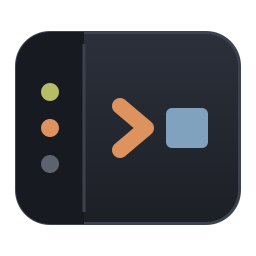

<div align="center">



# berth

**A GPU terminal that never loses your agent's work.**

[](https://github.com/xsser/berth/actions/workflows/ci.yml)
[](https://github.com/xsser/berth/releases)
[](#status--路线)
[](#license--许可证)

[English](#english) · [中文](#中文)

</div>

---

## English

Close the window, reopen it tomorrow, and every session is exactly where you left it — same
scrollback, same screen, same agent. berth is a terminal built around one idea: **the terminal
window is a view, not the owner of your work.**

It is made for people who run [Claude Code](https://www.anthropic.com/claude-code), Codex CLI and
other coding agents all day, in many sessions at once, and keep losing track of which one is
waiting for them.

### Why

A normal terminal ties a session's life to a window. Quit the app and the PTY dies with it: the
scrollback is gone, the agent is gone, and an agent that was waiting for your approval simply
disappears. Multiplexers fix the lifetime but give you nothing about *what the agent is doing*.

berth splits the two. A background daemon (`berthd`) owns every PTY, terminal state and snapshot.
The GUI is a client that attaches to it. Nothing you close kills anything you care about.

### Features

- **Sessions outlive the window.** `berthd` keeps the PTY and the terminal state; closing the
  window detaches, it does not kill. Snapshots go to disk periodically, so even a daemon restart
  returns the scrollback and the last screen as a read-only prefix you can revive from.
- **Agent-aware sidebar.** Every session shows what its agent is doing: idle, thinking, running a
  tool, **waiting for permission**, waiting for input, done, failed. States come from official
  Claude Code hooks and Codex notifications, with shell integration (OSC 133/7) and process
  heuristics as fallbacks — never guessing over a fact.
- **Notifications that respect your attention.** A session that needs you raises a macOS
  notification and a Dock badge — unless it is already on screen in front of you.
- **Splits.** `⌘D` right, `⌘⇧D` down, `⌥⌘←→↑↓` to move, draggable dividers. The layout is saved and
  restored with the window. Four 120×40 panes render in ~2 ms p99 on an M-series Mac.
- **Archive instead of delete.** `⌘W` archives a session: the process ends, everything else stays.
  Find it under **归档 / Archive** in the sidebar, restore it, or delete it for good. Sessions idle
  for more than a week archive themselves (configurable, off with `0`).
- **Light by default, yours to override.** A white terminal with the One Light palette. Upstream's
  colors are tuned for a gray editor background, so some are darkened for pure white, and by what
  the slot is for: the normal colors carry body text — `ls`, diffs, compiler output — and are held
  to 4.5:1 (red, green, yellow, cyan and white moved); the bright ones only mark that text and
  keep 3:1, where bright magenta alone fell short. One line of config switches to the old
  dark theme, and any single color — background, foreground, cursor, accent, the sixteen ANSI
  colors — can be replaced on top of either preset. The sidebar, dividers, notices and menus are
  all derived from it, so nothing is left behind in the other theme — and programs that ask the
  terminal for its colors (OSC 10/11/4; Codex picks its input box that way) are told the same.
- **GPU rendering.** wgpu + a custom cell grid, egui for the sidebar. Ligature-free monospace
  shaping via cosmic-text, a shared glyph atlas across panes.
- **Nothing installed behind your back.** `berth setup-hooks claude` prints a JSON diff and writes
  only with `--yes`, after a backup; `--undo` restores it byte for byte. `berth doctor` is
  read-only.

### Install

Requires Rust 1.85+ and macOS.

```sh
git clone git@github.com:xsser/berth.git
cd berth
cargo build --release --workspace
cp target/release/{berth,berthd,berth-hook} ~/.local/bin/   # anywhere on your PATH
berth                                                       # starts berthd if needed
```

Or build a proper macOS app and drop it in `/Applications`:

```sh
./packaging/make-app.sh                  # dist/Berth.app, ad-hoc signed
ditto dist/Berth.app /Applications/Berth.app
```

The bundle carries all three binaries in `Contents/MacOS`, and `berth` looks for `berthd` next to
itself before it looks at `PATH`, so the app is self-contained. With it installed, point
notifications at berth's own identity instead of borrowing Terminal's:

```toml
[notify]
identity = "io.github.xsser.berth"
```

To let berth see Claude Code's state, install the hooks — read the diff first, then confirm:

```sh
berth setup-hooks claude          # prints the diff, writes nothing
berth setup-hooks claude --yes    # backs up ~/.claude/settings.json, then writes
berth setup-hooks claude --undo   # restores the backup byte for byte
berth setup-hooks codex --yes     # chains Codex's notify through berth-hook
```

Colors live in `~/.config/berth/config.toml` (the same file the daemon reads). Every key is
optional; a value that is not a color is skipped with a warning and the rest still applies:

```toml
[theme]
preset = "dark"           # "light" (default) | "dark"
accent = "#0a7d55"        # pulse, 「N 需关注」, agent glyph, error copy, focused pane border
background = "#fffdf6"    # foreground, cursor, cursor_text and ansi = [16 colors] too
```

The file is read once at startup, so restart `berth` to apply a change.

### Keys

| Key | Action |
|---|---|
| `⌘N` / `⌘T` | New session in the current workspace |
| `⌘⇧N` | New workspace (folder picker) |
| `⌘1`–`⌘9` | Jump to a session |
| `⌘D` / `⌘⇧D` | Split right / down |
| `⌥⌘` + arrows | Move focus between panes |
| `⌘W` | Close the pane and archive its session |
| `⌘K` | Command panel |

Right-click a session row, a workspace header or the terminal for the rest: split, rename, archive,
restore, delete for good, copy, paste.

### How it works

```
┌────────────┐   unix socket, postcard frames   ┌─────────────────────────────┐
│ berth (GUI)│ ───────────────────────────────▶ │ berthd                      │
│ winit+wgpu │ ◀─────────────────────────────── │  PTYs · VT state · snapshots│
└────────────┘   screens, agent state, events   │  SQLite registry            │
                                                └─────────────────────────────┘
      ▲                                                       ▲
      │ desktop notifications, Dock badge                     │ hook events
      │                                              ┌────────────────────┐
      └──────────────────────────────────────────────│ berth-hook         │
                                                     │ claude · codex     │
                                                     └────────────────────┘
```

- `berth-core` — frozen wire types, protocol, snapshot formats.
- `berth-vt` — PTY + VT parsing (portable-pty, alacritty_terminal) and an OSC prescanner.
- `berth-store` — SQLite (WAL) registry and zstd snapshots.
- `berth-daemon` — session actors, agent state machine, hook routing, auto-archive.
- `berth-hook` — the tiny binary your agent's hooks call; it forwards nothing outside a berth session.
- `berth-app` — the GUI, the CLI (`list`, `doctor`, `setup-hooks`) and the renderer.

Design notes live in [docs/DESIGN.md](docs/DESIGN.md), progress and known gaps in
[docs/progress.md](docs/progress.md).

### Status · 路线

Working today on macOS: the four goals above, `berth list` / `doctor` / `setup-hooks`, zsh shell
integration, splits, archive and a packaged `.app`. Not there yet: Linux, bash/fish integration,
search in scrollback. The protocol is versioned, so a stale daemon is detected and can be restarted
from the GUI.

---

## 中文

关掉窗口，明天再打开，每个 session 还停在你离开时的样子：同样的滚动历史、同样的屏幕、同样的 agent。
berth 只围绕一件事设计：**终端窗口是一个视图，不是你工作的所有者。**

它是给那些整天开着一堆 [Claude Code](https://www.anthropic.com/claude-code)、Codex CLI 的人用的
——会话一多就分不清哪个在跑、哪个卡住了在等你点确认。

### 为什么

普通终端把 session 的生命绑在窗口上。退出应用，PTY 跟着死：滚动历史没了，agent 没了，正在等你
授权的那个也就这么消失了。多路复用器解决了生命周期，却完全不知道 *agent 在干什么*。

berth 把这两件事拆开：常驻守护进程 `berthd` 持有所有 PTY、终端状态和快照，GUI 只是连上去的客户端。
你关掉的东西，不会带走你在乎的东西。

### 特性

- **session 活得比窗口久。** `berthd` 持有 PTY 与终端状态，关窗口只是断开，不是杀掉。快照定期落盘，
  即使 daemon 重启，滚动历史和最后一屏也会作为只读前缀回来，随时可以 revive。
- **能看懂 agent 的侧栏。** 每个 session 都显示它的 agent 在做什么：空闲、思考中、跑工具、**等待授权**、
  等待输入、完成、出错。状态来自 Claude Code 官方 hooks 与 Codex 通知，shell 集成（OSC 133/7）和前台
  进程识别只作兜底——推断永远不会覆盖事实。
- **不打扰的通知。** 需要你处理的 session 会发 macOS 通知并更新 Dock 角标，除非它正显示在你眼前。
- **分屏。** `⌘D` 向右、`⌘⇧D` 向下、`⌥⌘` 方向键切焦点，分隔条可拖。布局随窗口保存与恢复。四个 120×40
  的 pane 在 M 系列 Mac 上帧耗时 p99 约 2 ms。
- **用归档代替删除。** `⌘W` 归档一个 session：进程结束，其余全部保留。在侧栏「归档」区里找回、恢复，
  或者彻底删除。超过一周没动的会自动归档（可配置，设 `0` 关闭）。
- **默认浅色，颜色可自定义。** 白底终端配 One Light 配色。上游那套是给灰底编辑器调的，落到纯白上
  不够用，压暗按槽位的用途分两档：正常色 0-7 要承载 `ls`、diff、编译器输出这类正文，按 4.5:1 压暗了
  红、绿、黄、青、白；高亮色 8-15 只用来标记正文，保持 3:1，其中只有亮品红不够。一行配置切回原来的
  深色主题；背景、前景、光标、强调色、16 色 ANSI 也都能在任一预设之上逐键覆盖。侧栏、分隔线、通知条
  与菜单全部由主题推导，不会有一处还留在另一套配色里；程序向终端查询颜色（OSC 10/11/4，Codex 就靠它
  给输入框配色）得到的也是同一套。
- **GPU 渲染。** wgpu 自研单元格网格 + egui 侧栏，cosmic-text 做等宽排版，多个 pane 共享同一份字形图集。
- **不背着你改任何配置。** `berth setup-hooks claude` 先打印 JSON diff，只有 `--yes` 才写入，并先备份；
  `--undo` 按字节还原。`berth doctor` 全程只读。

### 安装

需要 Rust 1.85+ 与 macOS。

```sh
git clone git@github.com:xsser/berth.git
cd berth
cargo build --release --workspace
cp target/release/{berth,berthd,berth-hook} ~/.local/bin/   # 放到 PATH 上任意位置
berth                                                       # 需要时会自己拉起 berthd
```

也可以打包成正经的 macOS 应用放进 `/Applications`：

```sh
./packaging/make-app.sh                  # 产出 dist/Berth.app，带 ad-hoc 签名
ditto dist/Berth.app /Applications/Berth.app
```

三个二进制都在 `Contents/MacOS` 里，而 `berth` 找 `berthd` 时先看自己旁边、再看 `PATH`，
所以这个 bundle 是自包含的。装好之后可以让通知用 berth 自己的身份，不再借用 Terminal 的：

```toml
[notify]
identity = "io.github.xsser.berth"
```

要让 berth 看到 Claude Code 的状态，安装 hooks——先看 diff，再确认：

```sh
berth setup-hooks claude          # 只打印 diff，不写入
berth setup-hooks claude --yes    # 先备份 ~/.claude/settings.json，再写入
berth setup-hooks claude --undo   # 按备份逐字节还原
berth setup-hooks codex --yes     # 把 Codex 的 notify 串到 berth-hook 上
```

颜色写在 `~/.config/berth/config.toml`（daemon 读的是同一个文件）。所有键都可选，单个值非法只跳过
该键并告警，其余照常生效：

```toml
[theme]
preset = "dark"           # "light"（默认）| "dark"
accent = "#0a7d55"        # 脉冲、「N 需关注」、agent 图标、出错文案、聚焦 pane 边框
background = "#fffdf6"    # foreground、cursor、cursor_text、ansi = [16 色] 同理
```

配置只在启动时读一次，改完重启 `berth` 生效。

### 快捷键

| 按键 | 作用 |
|---|---|
| `⌘N` / `⌘T` | 在当前 workspace 新建 session |
| `⌘⇧N` | 新建 workspace（目录选择器） |
| `⌘1`–`⌘9` | 跳到第 N 个 session |
| `⌘D` / `⌘⇧D` | 向右 / 向下分屏 |
| `⌥⌘` + 方向键 | 在 pane 之间移动焦点 |
| `⌘W` | 关闭 pane 并归档它的 session |
| `⌘K` | 命令面板 |

其余操作在右键菜单里：侧栏 session 行、workspace 标题、终端区域各有一份，包含分屏、重命名、归档、
恢复、彻底删除、复制粘贴。

### 架构

- `berth-core` — 冻结的线格式类型、协议、快照格式。
- `berth-vt` — PTY 与 VT 解析（portable-pty、alacritty_terminal），以及 OSC 预扫描器。
- `berth-store` — SQLite（WAL）注册表与 zstd 快照。
- `berth-daemon` — session actor、agent 状态机、hook 路由、自动归档。
- `berth-hook` — agent 的 hooks 实际调用的小程序；不在 berth session 里就什么都不转发。
- `berth-app` — GUI、CLI（`list`、`doctor`、`setup-hooks`）与渲染器。

设计文档见 [docs/DESIGN.md](docs/DESIGN.md)，进度与已知缺口见 [docs/progress.md](docs/progress.md)。

### 现状

macOS 上已经可用：上面这四件事、`berth list` / `doctor` / `setup-hooks`、zsh 集成、分屏、归档与 `.app` 打包。
还没有：Linux、bash/fish 集成、滚动历史内搜索。协议带版本号，所以旧 daemon 会被识别出来，
可以从 GUI 里直接重启。

---

## License · 许可证

MIT OR Apache-2.0 — see [LICENSE-MIT](LICENSE-MIT) and [LICENSE-APACHE](LICENSE-APACHE).

<!-- Discord badge (add once the server exists):
[](https://discord.gg/<invite>)
-->
